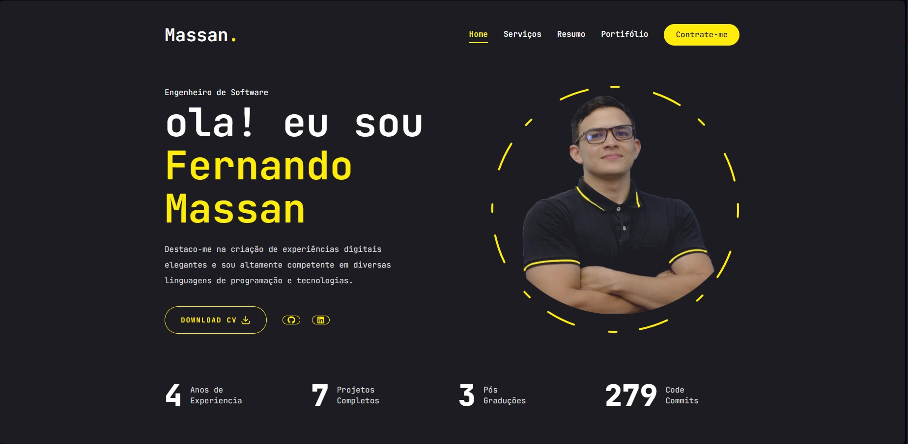
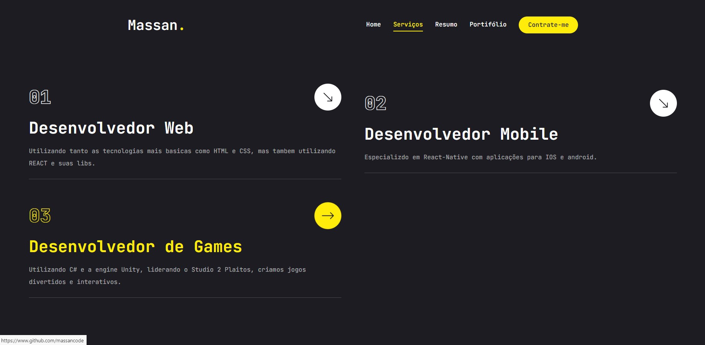
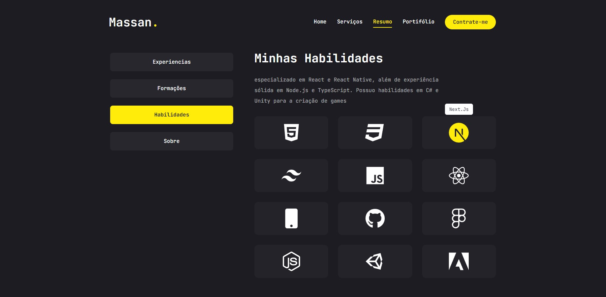
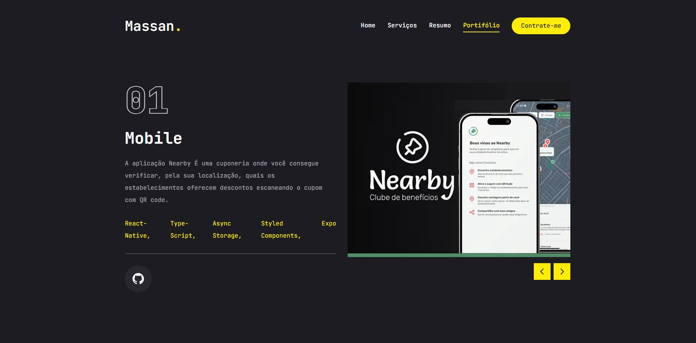
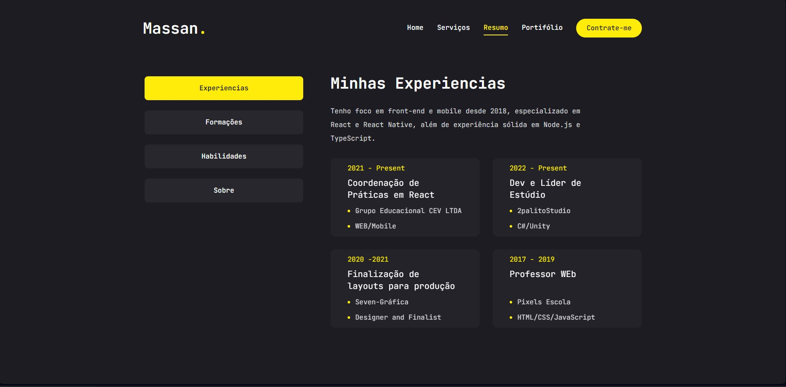

<h1 align="center">
  
</h1>


## 💻 Projeto

O **Ports** é meu site de portfólio, versátil e responsivo para qualquer tamanho de tela. Desenvolvido com Next.js, Tailwind CSS e Framer Motion.

Simples, direto e com boa fluidez! 🚀

## ✨ Tecnologias

Esse projeto foi desenvolvido com as seguintes tecnologias e ferramentas:

-   [ ] **React** - 
-   [ ] **Next.js** - 
-   [ ] **TypeScript** - 
-   [ ] **React Icons** - 
-   [ ] **Tailwindo CSS** - 
-   [ ] **Node.js** - 


## 🚀 Executando o Projeto

-Após clonar o repositório, siga os passos abaixo para rodar o projeto em seu ambiente local:

# Usando npm
-npm install

# usando yarn
-yarn install

# Agora so iniciar
-npx expo start

## 📸 Capturas de Tela

<table>
    <td align="center">
      
      <p>Home</p>
    </td>
    <td align="center">
      
      <p>services</p>
    </td>
    <td align="center">
      
      <p>About</p>
    </td>
    <td align="center">
      
      <p>Portifolio</p>
    </td>
    <td align="center">
      
      <p>services</p>
    </td>
</table>


This is a [Next.js](https://nextjs.org) project bootstrapped with [`create-next-app`](https://github.com/vercel/next.js/tree/canary/packages/create-next-app).

## Getting Started

First, run the development server:

```bash
npm run dev
# or
yarn dev
# or
pnpm dev
# or
bun dev
```

Open [http://localhost:3000](http://localhost:3000) with your browser to see the result.

You can start editing the page by modifying `app/page.js`. The page auto-updates as you edit the file.

This project uses [`next/font`](https://nextjs.org/docs/app/building-your-application/optimizing/fonts) to automatically optimize and load [Geist](https://vercel.com/font), a new font family for Vercel.

## Learn More

To learn more about Next.js, take a look at the following resources:

- [Next.js Documentation](https://nextjs.org/docs) - learn about Next.js features and API.
- [Learn Next.js](https://nextjs.org/learn) - an interactive Next.js tutorial.

You can check out [the Next.js GitHub repository](https://github.com/vercel/next.js) - your feedback and contributions are welcome!

## Deploy on Vercel

The easiest way to deploy your Next.js app is to use the [Vercel Platform](https://vercel.com/new?utm_medium=default-template&filter=next.js&utm_source=create-next-app&utm_campaign=create-next-app-readme) from the creators of Next.js.

Check out our [Next.js deployment documentation](https://nextjs.org/docs/app/building-your-application/deploying) for more details.
